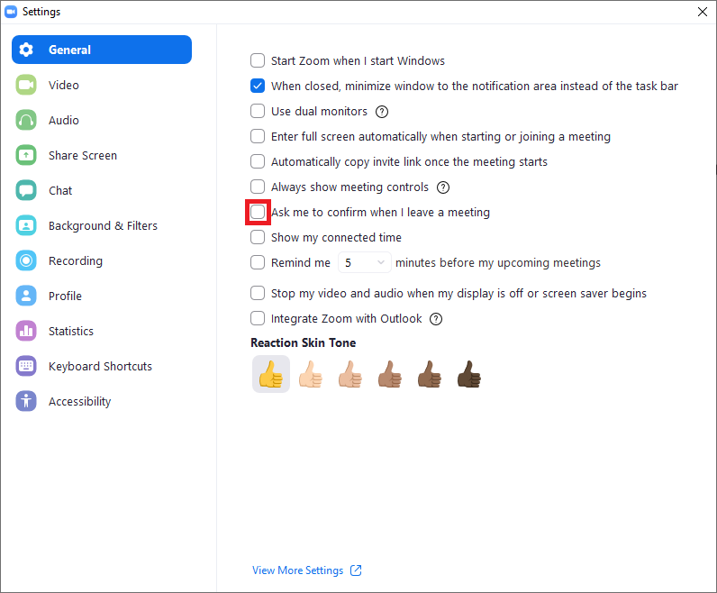

# Zoom-Meeting-Attender
---

This is a python bot made with pyautogui that will:
1) log into zoom
2) join the meeting on start time
3) leave the meeting on end time 
4) Do this for how many ever meetings you set for the day

#How to run this file on your computer: 

Download requirements:
```
pip install -r requirements.txt
```
In [meetings.csv](https://github.com/Girik1105/Zoom-Meeting-Attender/blob/master/meetings.csv) add the start time, end time, meeting id and password

Then run the python file:
```
python main.py
```

# Some zoom settings to make sure this python script works: 
---


- Remember to UNCHECK this so that the script can automatically leave the meeting.
- Please use light mode(sorry) for zoom panel.

#How does it work?
---

- This python script reads csv files which extracts 4 parameters(meeting id, meeting password, start time and end time).
- It runs a while loop in which an if statement checks if any meeting start time is equal to current time and as soon as there is one it executes join_meeting()
- join meeting() uses os.startfile to open zoom, then using locateCenteronScreen method in pyautogui with the help of [locators](https://github.com/Girik1105/Zoom-Meeting-Attender/tree/master/locators) finds the join button, clicks on it then enters meeting id and password, and finally joins it.
- The while loop is still running and with another if statement it's seeing if the current time is equal to the end time and then executes leave_meeting()
- leave_meeting just uses pyautogui hotkey to close the application.
- This process repeats till all meetings are completed 
- 3 variables help track when all the meetings are concluded, it breaks from the while loop.
